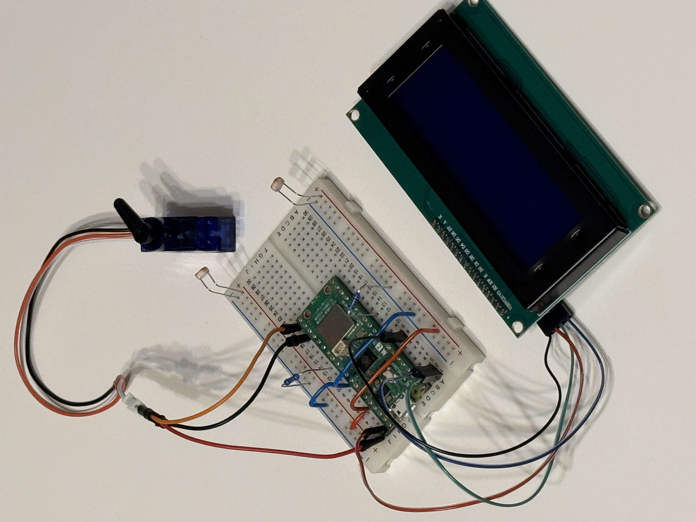
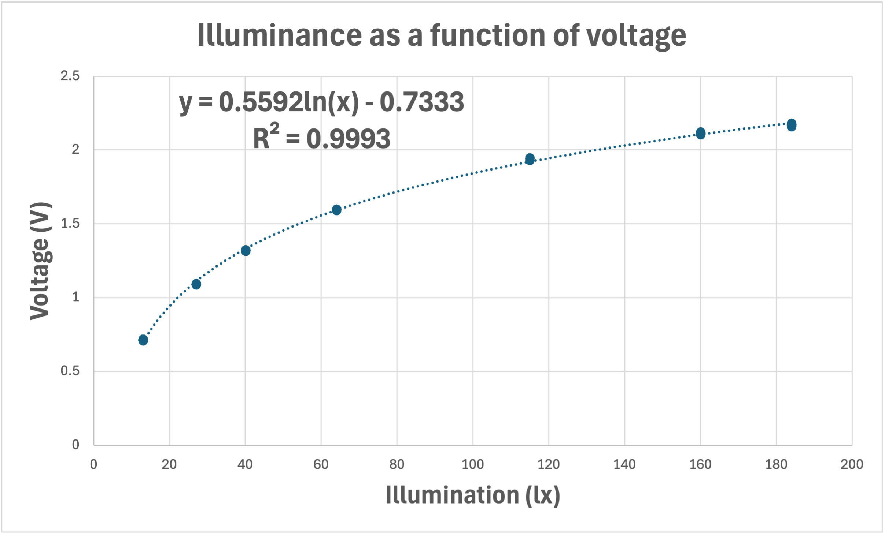
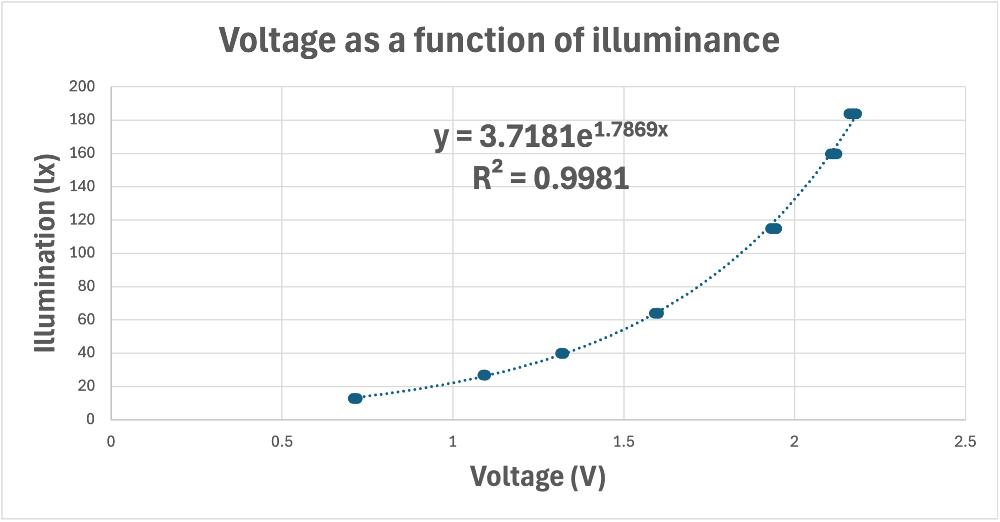
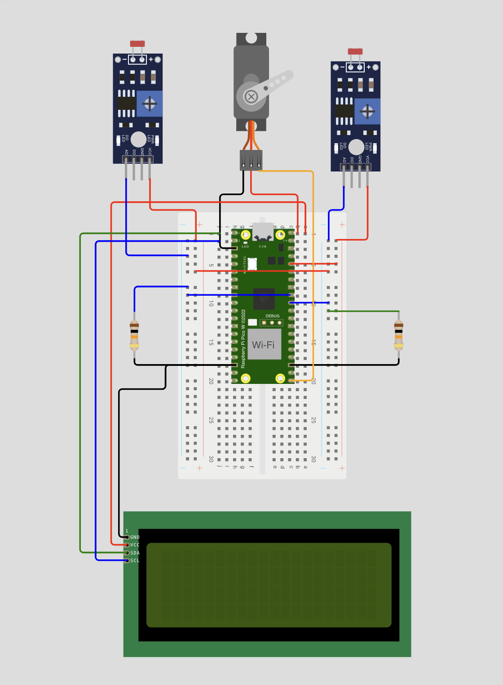

# sun-follower

This project implements a dual LDR light tracker using a Raspberry Pi Pico 2 W and a servo motor.
The program continuously reads two light sensors (LDRs) through the ADC, calculates light intensity using an exponential calibration model, and adjusts the servo angle to point toward the brighter source.

Features:
* Exponential voltage-lux calibration (based on experimental data)
* Adjustable deadband to eliminate servo jitter
* Exponential Moving Average (EMA) filtering
* Proportional control for smooth and stable movement
* Designed for solar tracker or robotics applications

Project can [try](https://wokwi.com/projects/445083315844734977) on [Wokwi simulator](https://wokwi.com/). It's little bit different from real hardware because of simulator limitations.

